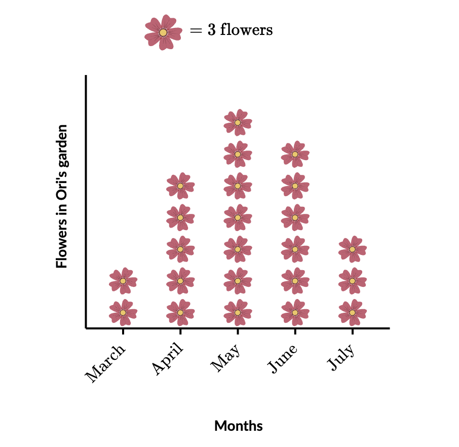

# Probability & Statistics DAY 0

1. Millions of Americans rely on caffeine to get them up in the morning. Here's nutritional data on Copy link some popular drinks at Ben's Beans coffee shop:

   | **Drink**              | **Type** | **Calories** | **Sugars (g)** | **Caffeine (mg)** |
   | ---------------------- | -------- | ------------ | -------------- | ----------------- |
   | **Brewed coffee**      | Hot      | $4$          | $0$            | $260$             |
   | **Caffè latte**        | Hot      | $100$        | $14$           | $75$              |
   | **Caffè mocha**        | Hot      | $170$        | $27$           | $95$              |
   | **Cappuccino**         | Hot      | $60$         | $8$            | $75$              |
   | **Iced brewed coffee** | Cold     | $60$         | $15$           | $120$             |
   | **Chai latte**         | Hot      | $120$        | $25$           | $60$              |

   1. The individuals in this data set are:
      1. Ben’s Beans customers
      2. Ben’s Beans drinks
      3. Caffeine contents
      - Answer
        - Individuals could be things, not necessarily people
        - Each row refers to a certain type of drink
          Answer: **b. Ben’s Beans drinks**
   2. This data set contains:
      1. $4$ variables, $1$ of which is categorical
      2. $4$ variables, $2$ of which is categorical
      3. $6$ variables, $1$ of which is categorical
      4. $6$ variables, $2$ of which is categorical
      - Answer
        - The drink name is an identifier
        - “Type” can take only a certain number of values so it is categorical
        - “Calories”, “Sugars (g)”, “Caffeine (mg)” can take any real number so it is not categorical
          Answer: **a. $4$ variables, $1$ of which is categorical**

2. Madison recorded weather conditions for some major cities on the same day. Here is some of the data she collected.

   | **City name**     | **High temp. (degrees Celsius)** | **Kind of precipitation** | **Average wind speed (kilometers per hour)** | **Severe weather alert?** |
   | ----------------- | -------------------------------- | ------------------------- | -------------------------------------------- | ------------------------- |
   | **Detroit**       | $26$                             | rain                      | $15$                                         | no                        |
   | **San Francisco** | $20$                             | none                      | $17$                                         | no                        |
   | **New York**      | $20$                             | rain                      | $6$                                          | yes                       |
   | ...               | ...                              | ...                       | ...                                          | ...                       |

   1. The individuals in this data set are:
      1. Cities
      2. Average wind speeds
      3. Weather conditions
      - Answer
        - Each row refers to a city
          Answer: **a. Cities**
   2. This data set contains:
      1. $4$ variables, $1$ of which is categorical
      2. $4$ variables, $2$ of which is categorical
      3. $3$ variables, $1$ of which is categorical
      4. $3$ variables, $2$ of which is categorical
      - Answer
        - “Kind of precipitation” and “Severe weather alert?” can take only a certain number of values so it is categorical
        - “High temp. (degrees Celsius)” and “Average wind speed (kilometers per hour)” can take any real number so it is not categorical
          Answer: **b. $4$ variables, $2$ of which is categorical**

3. Rachael gave a survey to her classmates to learn about their superstitions. Here's some of the data she collected.

   | **Student name** | **Gender** | **Age** | **Birth month** | **Read horoscope?** |
   | ---------------- | ---------- | ------- | --------------- | ------------------- |
   | **Jacob**        | Male       | $17$    | April           | yes                 |
   | **Trenae**       | Female     | $17$    | January         | no                  |
   | **Maura**        | Female     | $16$    | February        | no                  |
   | **...**          | ...        | ...     | ...             | ...                 |

   1. The individuals in this data set are:
      1. Rachael's teachers
      2. Rachael's classmates
      3. Horoscopes
      - Answer
        - Each row refers to a student
          Answer: **b. Rachael's classmates**
   2. This data set contains:
      1. $4$ variables, $1$ of which is quantitative
      2. $4$ variables, $2$ of which is quantitative
      3. $3$ variables, $1$ of which is quantitative
      4. $3$ variables, $2$ of which is quantitative
      - Answer
        - “Gender”, “Read horoscope?”, and “Birth month” can take only a certain number of values so it is categorical
        - “Age” can take any real number so it is not categorical
          Answer: **a. $4$ variables, $1$ of which is quantitative**

4. The school counselor needs to meet with students who have more than three absences. Here is some of the data about the students.

   | **Student name** | **Homeroom teacher** | **Absences** |
   | ---------------- | -------------------- | ------------ |
   | **Arianna**      | Mr. Shea             | $4$          |
   | **Priyanka**     | Ms. Hartley          | $4$          |
   | **Vivek**        | Ms. Cowan            | $6$          |
   | **Suraj**        | Mr. Rankin           | $5$          |
   | **Julia**        | Ms. Andersen         | $6$          |
   | **...**          | ...                  | ...          |

   1. The individuals in this data set are:
      1. School counselors
      2. Homeroom teachers
      3. Students
      - Answer
        - Each row refers to a student
          Answer: **c. Students**
   2. This data set contains:
      1. $2$ variables, $1$ of which is quantitative
      2. $2$ variables, $2$ of which is quantitative
      3. $5$ variables, $1$ of which is quantitative
      4. $5$ variables, $3$ of which is quantitative
      - Answer
        - “Homeroom teacher” can take only a certain number of values so it is categorical
        - “Absences” can take any real number so it is not categorical
          Answer: **a. $2$ variables, $1$ of which is quantitative**

5. According to the pictograph below, how many survey respondents have type O+ blood? How many have O- blood? :

   | Blood Group | Type | Number of People |
   | ----------- | ---- | ---------------- |
   | A           | +    | 🩸🩸🩸🩸🩸🩸🩸   |
   | A           | -    |                  |
   | B           | +    | 🩸🩸🩸🩸         |
   | B           | -    | 🩸               |
   | AB          | +    | 🩸               |
   | AB          | -    | 🩸🩸             |
   | O           | +    | 🩸🩸🩸🩸🩸🩸🩸🩸 |
   | O           | -    | 🩸🩸             |

   🩸 $$=8$$ people

   - Answer
     - O+ has $8$ 🩸 and each 🩸 corresponds to $8$ people so it is $8 \times 8 = 64$
     - O- has $2$ 🩸 and each 🩸 corresponds to $8$ people so it is $2 \times 8 = 16$
       Answer: $64,16$

6. The picture graph below shows the flowers in Ori's garden over several months.

   

   1. How many fewer flowers did Ori have in her garden in March and July combined than in May?
      - Answer
        - March has $2$ and July has $3$ and the total is $5$ which is $2$ less than May’s $7$ so it is $2 \times 3 = 6$
          Answer: $6$

7. Nancy put $80$ acorns in her backyard. Then, she made a graph of how many acorns different types of squirrels ate.

   

   1. How many acorns were left after the squirrels ate?
      - Answer
        - Total is $4 \times (5.5 + 2 + 6 + 2.5) = 4 \times 16 = 64$
        - Total left over is $80-64=16$

8. James just moved to a new home. He made a graph showing the number of boxes in each room.

   

   James moved $3$ boxes from the living room to the bedroom.

   1. After James moved those $$3$$ boxes, which two rooms had the same number of boxes?
      1. Living room
      2. Kitchen
      3. Bathroom
      4. Bedroom
      - Answer
        - Bedroom has $5 \times 3 = 15$ boxes same as the Kitchen
          Answer: **b. Kitchen, d. Bedroom**

9. Iris is heading a recycling drive. The chart below gives the number of kilograms of each kind of recycling brought to the drive.

   

   1. How many kilograms of recycling have been brought to the drive in all?
      - Answer
        - $3 \times (8 + 2 + 4 + 6) = 60$
          Answer: $60$

10. Based on the data below, which student's score improved the most between the midterm and final exams?

    

    - Answer
      - Jasmine, Nevin, and Alejandra improved and the difference in bar size is maximum for Alejandra
      - Jeff and Marta did not improve
        Answer: **Alejandra**

11. At Hogwarts, there are four houses: Gryffindor, Hufflepuff, Ravenclaw, and Slytherin. The bar chart below shows the number of house points that each house received today. How many house points did Hufflepuff receive?

    

    - Answer
      - Height of bar is $3$
        Answer: $3$

12. At Hogwarts, there are four houses: Gryffindor, Hufflepuff, Ravenclaw, and Slytherin. The bar chart below shows the number of house points that each house received today. How many house points did Slytherin receive?

    

    - Answer
      - Height of bar is $4$
        Answer: $4$

13. $20$ teacherg were asked about their favorite course. $7$ teachers said language. $3$ teachers said history. $9$ teachers said geometry. $1$ teacher said chemistry. $0$ teachers said physics. Create a bar chart showing everyone's favorite courses:
    - Answer
      - Height of bar is the value
        Answer:
        
14. Jack created a chart and a bar graph to show how many of each type of nut were in his can of mixed nuts.

    | **Kind of nut** | **Number in the can** |
    | --------------- | --------------------- |
    | Pecans          | $21$                  |
    | Almonds         | $24$                  |
    | Cashews         | $18$                  |
    | Walnuts         | $15$                  |

    Label each bar on the bar graph.

    

    - Answer
      - Height of bar is the value
        Answer:
        

15. The table below shows the number of students in each grade at Tobler Elementary School.

    | **Grade** | **Number of students** |
    | --------- | ---------------------- |
    | First     | $100$                  |
    | Second    | $150$                  |
    | Third     | $125$                  |
    | Fourth    | $75$                   |

    Which graph below shows the most reasonable scale for the information in the table?

    

    

    

    - Answer
      - The most common Pairwise Highest Common Factor is generally used as a scale
        Answer: **b**

16. Arthur asked all of the third graders about their favorite after-school activity.

    | **Activity** | **Number of students** |
    | ------------ | ---------------------- |
    | Spanish club | $40$                   |
    | Spirit club  | $56$                   |
    | Cooking club | $24$                   |
    | Art club     | $64$                   |

    Create a bar graph to show how many times each activity was chosen as a student's favorite.

    

    - Answer
      - Height of bar is the value
        Answer:
        

17. Mega created a chart and a bar graph with the numbers of visitors in each section of the museum during one hour.

    | **Section**          | **Number of visitors** |
    | -------------------- | ---------------------- |
    | Waterworks           | $80$                   |
    | Around the World     | $70$                   |
    | Ecostation           | $60$                   |
    | History Theater      | $110$                  |
    | Invention Convention | $90$                   |

    Label each bar on the bar graph.

    

    - Answer
      - Height of bar is the value
        Answer:
        

18. Wayne the Weatherman was preparing to give his evening weather report. He called all the local weather stations to find out how much snow fell in all the nearby towns during the last winter storm.

    | Town         | Amount of snow |
    | ------------ | -------------- |
    | Winter Land  | $9$ cm         |
    | Snow Village | $21$ cm        |
    | Flake Town   | $15$ cm        |
    | Chilly City  | $6$ cm         |

    Create a bar graph to show how much snow fell in each town during the winter storm.

    

    - Answer
      - Height of bar is the value
        Answer:
        

19. The conductor created a chart and a bar graph to show how many of each type of instrument were in the orchestra.

    | **Kind of instrument** | **Number in orchestra** |
    | ---------------------- | ----------------------- |
    | String                 | $32$                    |
    | Brass                  | $16$                    |
    | Woodwind               | $24$                    |
    | Percussion             | $8$                     |

    Label each bar on the bar graph.

    

    - Answer
      - Height of bar is the value
        Answer:
        

20. The table below shows different types of apples in Pitt's Apple Orchard.

    | Apple Type   | Number of apples |
    | ------------ | ---------------- |
    | Granny Smith | $48$             |
    | Gala         | $36$             |
    | Fuji         | $60$             |
    | Rome         | $44$             |
    | Pink Lady    | $72$             |

    Which graph below shows the most reasonable scale for the information in the table?

    

    

    

    - Answer
      - The most common Pairwise Highest Common Factor is generally used as a scale
      - The graph should be able to represent all data points
        Answer: **c**

21. By how many points did Nadia's score improve from the midterm to the final exam?

    

    - Answer
      - Calculate difference in bar which is $85-75=10$
        Answer: $10$

22. How many students improved their scores from the midterm to the final exam?

    

    - Answer
      - Check the bars that have increased from Midterm to Final
      - Brandon, Vanessa, Daniel, and Kevin have improved
      - William has not improved
        Answer: $4$

23. Alice graphed how many books in the school library are about her favorite subjects.

    

    Alice has read $10$ of these books.

    1. How many books about Alice's favorite subjects that she has not read are in her school library?
       - Answer
         - $(25 + 15 + 30 + 40) - 10 = 100$
           Answer: $100$

24. The graph below shows the number of dogs that came into Puppy Party Place each weekday.

    

    1. On which day did the same number of dogs come to Puppy Party Place as on Monday and Wednesday combined?
       - Answer
         - $(80 + 80) = 160$
           Answer: Tuesday

25. The graph shows the favorite ice cream flavors for customers at Dessert Zone.

    

    After Dessert Zone made the graph, $25$ people changed their vote from chocolate to strawberry.

    1. After those $25$ people changed their vote, which $2$ flavors were the favorite of the same number of customers?
       1. Vanilla
       2. Chocolate
       3. Strawberry
       4. Cookie dough
       - Answer
         - Chocolate is $225-25=200$ which is the same as Cookie dough
           Answer: Chocolate and Cookie dough

26. The graph shows the number of vehicles built at a factory last month.

    

    How many fewer bulldozers were built than garbage trucks and motorcycles combined?

    - Answer
      - $(4+18)-10=12$
        Answer: $12$

27. The graph shows the number of vehicles built at a factory last month.

    

    1. What was the median score for the final exam?
       - Answer
         - $[100,100,100,75,80]$ ⇒ $[75,80,100,100,100]$
         - Middle most number for odd number of elements after sorting
           Answer: $100$
    2. What is the midrange of the midterm scores?
       - Answer
         - $\frac{max + min}{2}=mid$ ⇒ $\frac{100+60}{2}$
           Answer: $80$
    3. What was the average student score for the final exam?
       - Answer
         - $\frac{100+100+100+75+80}{5}=\bar{x}$
           Answer: $91$
    4. What was the mode for the final exam scores?
       - Answer
         - Most frequently occurring element
           Answer: $100$
    5. What is the range of the midterm scores?
       - Answer
         - $max - min=R$ ⇒ $100-60$
           Answer: $40$
